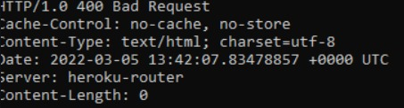
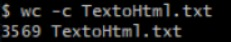
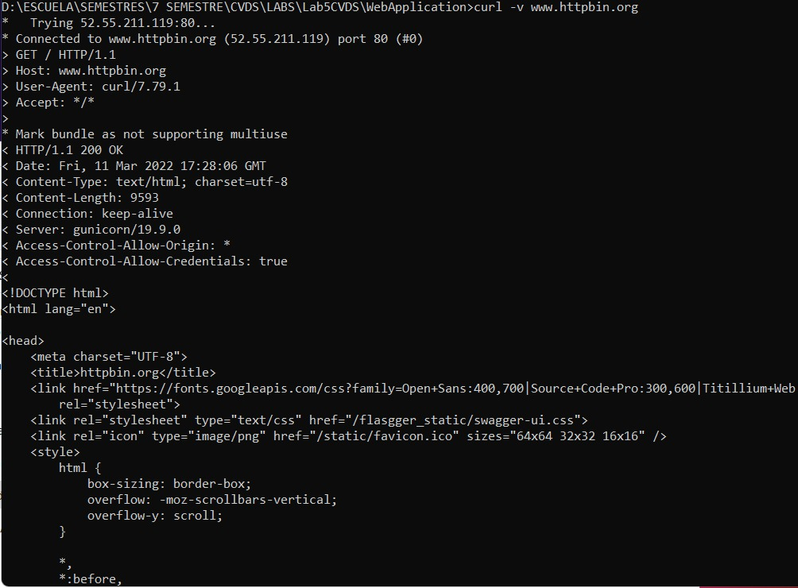
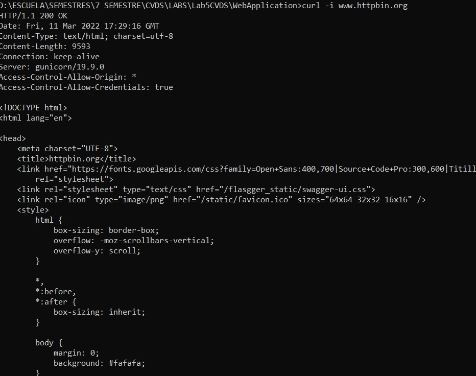
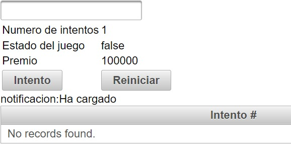

## TALLER 5
## ESCUELA COLOMBIANA DE INGENIERÍA
## INTRODUCCIÓN A PROYECTOS WEB
### Integrantes:
### Yesid Carrillo
### Ronaldo Henao

1. Conexion telnet www.escuelaing.edu.co 80\
\
Al realizar esa consulta sale el error 400 de tipo bad request
* Otros tipos de errores:
1. Informacion 100
2. Mensaje 200
3. Redireccion 300
4. Error servidor 500 
2. Conexion telnet www.httpbin.org 80\

3. wc -c\
\
numero de lineas del archivo HTML
* Diferencias entre GET y POST:\
El metodo GET solicita una representacion de un recurso especifico\
El metodo POST es utilizado para enviar una entidad a un recurso en especifico\
* Otros metodos:
1. HEAD
2. PUT
3. DELETE
4. CONNECT
5. OPTIONS
6. TRACE
7. PATCH

4.
* curl www.httpbin.org
* curl -v www.httpbin.org\

* curl -i www.httpbin.org\

* Diferencias parametros -v y -i
-v, --verbose Hacer que la operación sea más comunicativa
-i, --include Incluir encabezados de respuesta de protocolo en la salida
Usamos el siguiente comando para crear el arquetipo:

```mvn archetype:generate -DgroupId=edu.eci.cvds -DartifactId=WebApplication -DarchetypeArtifactId=maven-archetype-webapp-Dpackage=edu.eci.cvds.servlet -DinteractiveMode=false```

una vez hechas las configuraciones en el pom cargamos el servidor con:

```mvn package``` 

```mvn tomcat7:run```

Cargamos en la pagina la direccion:

```http://localhost:8080/helloServlet?name=Yesid```

donde el name es la variable del servlet ubicado en la clase SampleServlet.

* Resultado final:\

